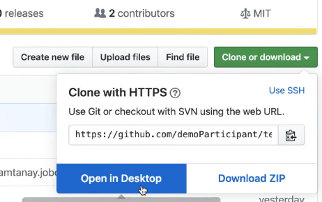
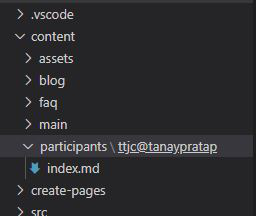
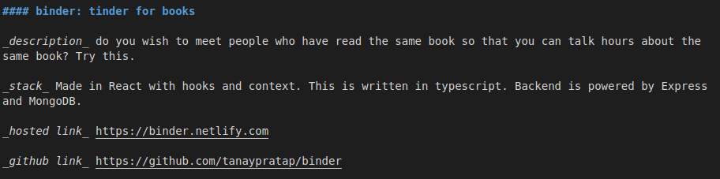
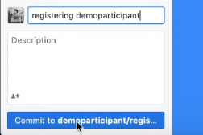
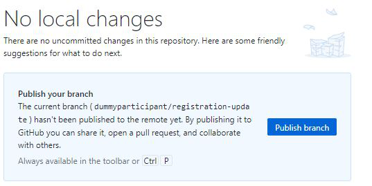
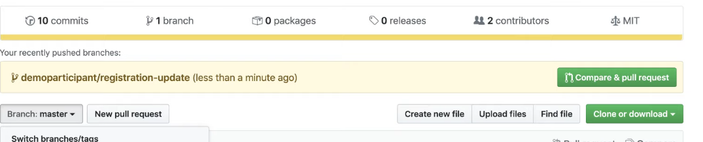
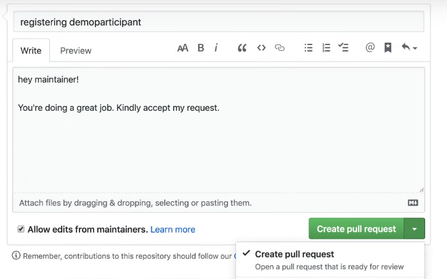
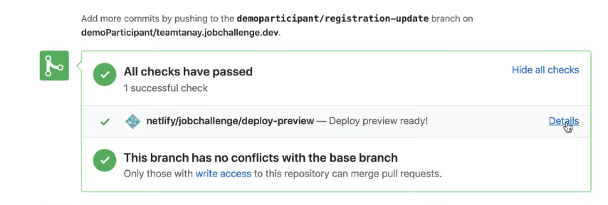
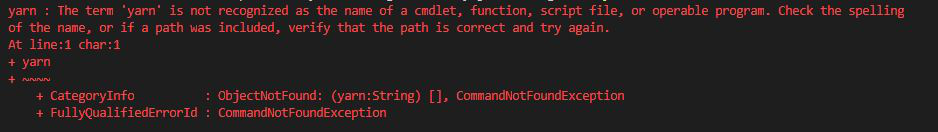

Yes, you need to register to participate. You just need to follow the steps below. We'll help you complete the challenge.

What are the prerequisites to participate in this challenge?

1. [Git/GitHub](https://www.youtube.com/watch?v=jUxy4WNdc0s&t=3244s)
2. [Markdown](https://guides.github.com/features/mastering-markdown/)
3. [Vscode editor](https://code.visualstudio.com/)
4. [NodeJs](https://nodejs.org/en/
)
5. [Yarn](https://classic.yarnpkg.com/en/docs/install/ 
)

**Note:**  _You might get some errors if your system doesn't have the dependencies, in that case please go through the end of this page and see troubleshooting steps_

## Registration steps:
[](https://www.youtube.com/watch?v=QzjgBj9oaAA&t=479s)

You can click the image above and follow the youtube video to register or follow the steps below.

### Step 1: Download the project
1. Login to your github account.
2. Go to https://github.com/tanaypratap/teamtanay.jobchallenge.dev
 3. Click on fork.( It will create a copy of the project in your account)
 4. Now you need to clone the project. Click on Clone or download button and choose open in Desktop.
 
    
5. In github desktop:
    * Choose the path / folder where you want to save the  project.
    * Click on Clone.
    * Click on open in Visual studio code.


### Step 2: Run the website locally
1. Open terminal in Vscode.
2. Create a branch eg:
    ```console
    ~$ git checkout -b your_github_id/registration-update
    ```
    This will be needed later for making a pull request.
3. Type:
    ```console
    ~$ yarn
    ```
    This will install all the required packages.
    
4. Type: 
    ```console
    ~$ yarn start
    ```
    This is needed so that you can run the project locally and see what’s working and what is not before generating a pull request.
5. Now go to http://localhost:8000 to see the website
6. Got to  http://localhost:8000/participants. (We need to add your name here)

### Step 3: To add your name on the website:

1. In the project folder go to: content -> participants folder
2. You will find a ttjc@tanaypratap folder. This is a demo entry. (_Do not work in this folder if you do your pull request will not be accepted_)
3. Copy that folder and paste it. Now there will be two copies. 
    * The original one (don't touch that)
    * The copy one -> rename it
4. Rename the folder to ttjc@your\_github_id 
5. Now in the new folder you created fill your details. (All details are filled in Markdown)
    * **title:** you can put your name
    * **type:** do not change the type
    * **name:** will be your name.
    * **portfolio:** if you don’t have one right now you can leave it blank and update it later.
    * **github-link:** paste your github link here
    * **linkedin-link:** paste your linkedin link here
    * **looking-for:** put only internship or job (nothing else) 
    * **description:** This is like a heading on your linkedin account. 
    
        eg: Typescript | React | Node | GraphQl

    * **introduction** 
        
        Who you are in one or two lines.

    * **Why are you taking this challenge?**
        - because you want an internship.
        - because you want a job.

        Or any reason for which your taking this challenge.
    * **something interesting about you?**
        - I like to play dota.
        - I know lyrics to almost all bollywood songs.

        Think about something nice which would appeal to people as this could be a good connection point.
    * **help i need?**  
        - what help do you need during this challenge.
            
            eg: i don't know how authentication works.
    * **how to contact me?** 
    
        Add your twitter and linked accounts here and make them clickable.
    * **projects**

        If you have not done any then keep this place empty.
        
        Follow the following format for adding your project information.

        

    * **blogs**

        If you have not done any then keep this place empty.
        
        Follow the following format for adding your project information.

        

6. Fill the details and save it.
7. You can now see your entry at http://localhost:8000/participants. Check your details there.
8. A good example: 
https://github.com/tanaypratap/teamtanay.jobchallenge.dev/commit/15ad9c33faaea9ef416e94613ceda820e7ed004c

### Step 4: Now to create a pull request
1. Open your github desktop 
2.  Write a message (registering demo participant) and then click -> commit  to    your\_github_id/registration-update . 

3. Click on -> Publish branch

4. Now go to your github account. You will see a compare & pull request. Click on it.

5. Make sure Allow edits from the maintainer  is checked and scroll below to check your details once more before making a pull request.
6. You can write some message / comment then click on Create pull request.

7. After all checks are passed you can click on -> show all checks -> details Here you   can see your preview.



## Some errors you might face:

### 1. People facing problems with yarn and who don’t know how to install yarn


If you are facing error on writing the command "yarn", then you might not have installed yarn or you might not be having an internet connection.

To install yarn you can search on google "how to install yarn"

**Alternative:**
You can use npm instead of yarn.

1. Install [NodeJs](https://nodejs.org/en/).
2. After this, continue to [tutorial video](https://www.youtube.com/watch?v=QzjgBj9oaAA&t=479s) and just replace the commands "yarn" & "yarn start" with "npm install" & "npm start".
Which means, instead of writing
    * "yarn" you write "npm install"
    * "yarn start" you write "npm start"

### 2. When getting too many unseen error with a node project 
The best thing to do is:
- git clean -fdx
- yarn cache clean
These two commands completely clears the cache and you can start afresh

### 3. If you are still facing problems in registration this is an alternative way of doing it online without downloading the project locally.
1. Fork the repo.
2. Create a folder similar to ttjc@tanaypratap in your forked repo (ttjc@\<githubUsername>).
3. Edit details in your index.md. 
(Use edit option in Tanay's index.md, copy index.md in your folder and paste it in your index.md)
4. Make a commit and submit a PR.

Here's a good example and format you can follow - https://github.com/tanaypratap/teamtanay.jobchallenge.dev/commit/15ad9c33faaea9ef416e94613ceda820e7ed004c
